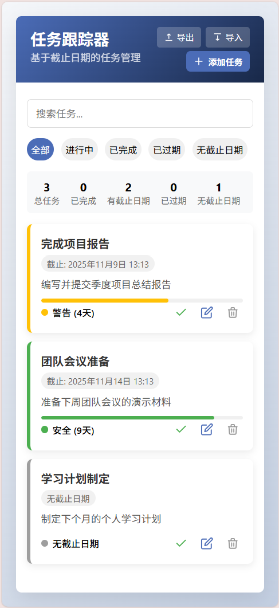
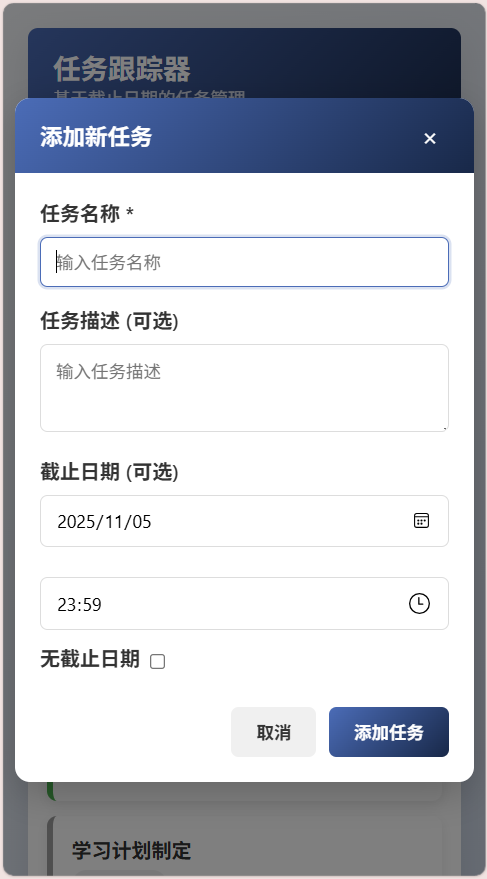

# 📝 Todo Manager / 任务跟踪器

一个轻量级的网页任务管理器，基于 **IndexedDB**，全部功能写在单个 HTML 文件中，支持任务的添加、编辑、删除、完成状态切换、截止日期管理、搜索、筛选、导入/导出以及进度可视化。

---

## 🚀 功能特点
- ✅ 添加、编辑、删除任务  
- ⏱ 支持任务截止日期，自动计算剩余时间  
- 🔔 任务状态动态显示：安全 / 警告 / 紧急 / 已过期  
- 🎯 支持搜索和筛选任务（全部 / 已完成 / 未完成 / 过期 / 无截止日期）  
- 📊 任务进度条显示截止时间进度  
- 📁 支持 JSON 导出与导入任务数据  
- 🎨 响应式设计，适配桌面和移动端 
- 📦 单文件 HTML，基于 IndexedDB 持久化，无需安装或服务器

---

## 🌐 在线地址

立即体验：https://todo.muquew.com/

---

## 📸 演示截图

<div style="display: flex; gap: 20px; justify-content: center; flex-wrap: wrap; align-items: flex-start;">
    
    
</div>


---

## 💻 使用方法
1. 直接下载或克隆仓库：
```bash
git clone https://github.com/muquew/Todo-Manager.git
````

2. 打开 `index.html` 在浏览器中运行：

```bash
open index.html
```

或直接在浏览器中拖拽打开。

3. 功能操作：

* 点击“添加任务”按钮创建新任务
* 编辑任务可修改名称、描述和截止日期
* 勾选“无截止日期”创建无截止日期任务
* 使用顶部筛选按钮快速查看不同状态任务
* 可通过“导出”备份任务，通过“导入”恢复任务数据

---

## 📂 项目结构

```
.
├── index.html  # 单文件，包含 HTML、CSS 和 JS
└── README.md   # 项目说明
```

---

## 🌟 未来改进

* 🔹 本地通知提醒任务截止
* 🔹 动态排序优化，支持拖拽排序
* 🔹 深色模式 / 自定义主题
* 🔹 多用户数据同步（使用云端存储）

---

## ⚖️ 许可协议

### 个人非商业使用许可 (Personal Non-Commercial License)

版权所有 (c) 2025 muquew

特此授予任何获得本软件及相关文档文件（以下简称“软件”）副本的个人用户，
在遵守以下条款的前提下使用本软件的权利：

1. 许可范围
   - 仅允许个人使用，包括学习、研究或个人任务管理。
   - 禁止任何形式的商业用途，包括但不限于销售、盈利性服务或商业分发。

2. 权利
   - 可以自由下载、使用和修改本软件用于非商业目的。
   - 可以备份、复制、分享本软件给其他个人用户。

3. 限制
   - 不得将本软件用于任何直接或间接的商业活动。
   - 不得以盈利为目的分发或出售本软件或其修改版本。

4. 免责声明
   - 本软件按“现状”提供，不附带任何明示或暗示的保证。
   - 作者不对因使用本软件产生的任何损失或责任承担责任。

---

**注意**：从本仓库下载或使用本软件即表示你同意遵守以上条款。


